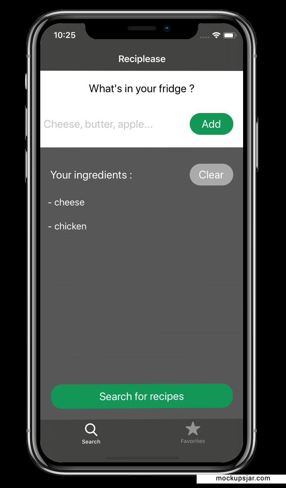
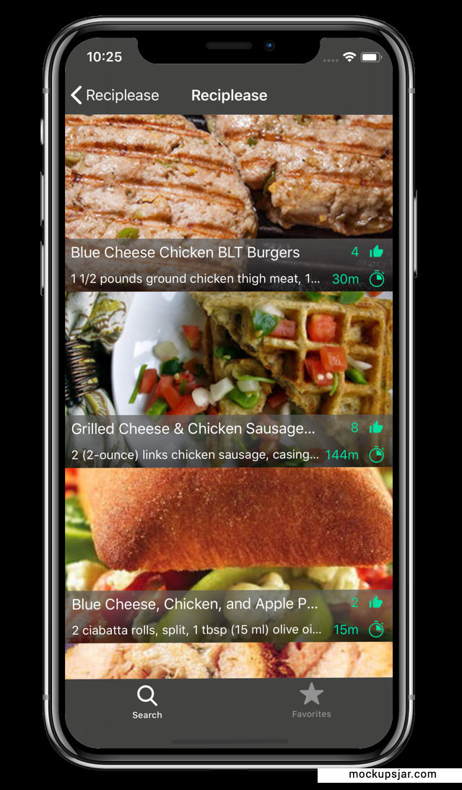
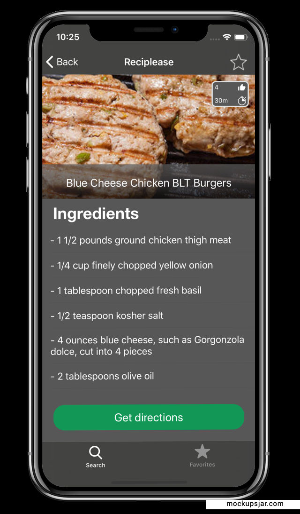
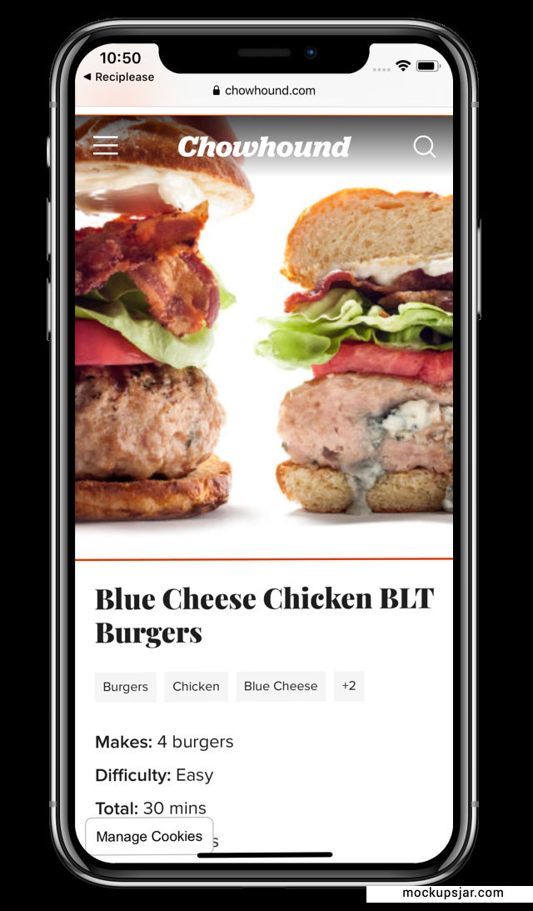
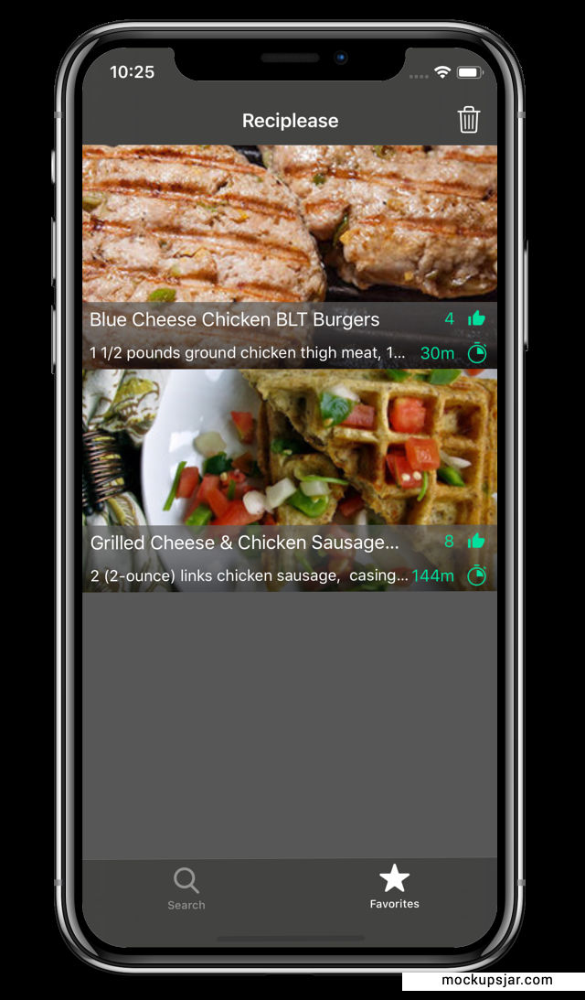

# Reciplease

## Tools
* Add libraries to Xcode project using **Cocoa Pods** :
  * __Alamofire__ for network call
  * __Mockinjay__ stubbing network for unit tests

* Data persistence using **Core data**

# Why Use Reciplease ?
**This application allows you to find recipes with the ingredients you have on hand**.  

## Ingredients 
First thing first, enter the ingredients :  
    
 

## Recipes List
Tap on "Search for recipes" and Reciplease will display a list of recipes :       
 
    

## Details 
Tap on the recipe that interests you and Reciplease will display the ingredients and quantity you'll need :  
 
     

## Get Directions 
Tap on "Get directions" to access the recipe website and recipe details :    
  
     

## Favorite
You'll can also save your favorite recipes in... the "Favorite" section :    

  
  
 # Enjoy !

  
 
