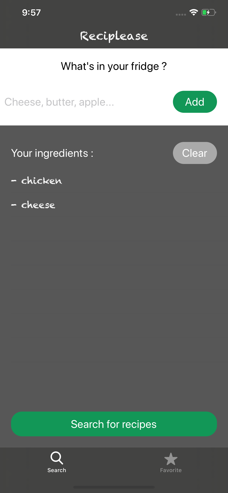
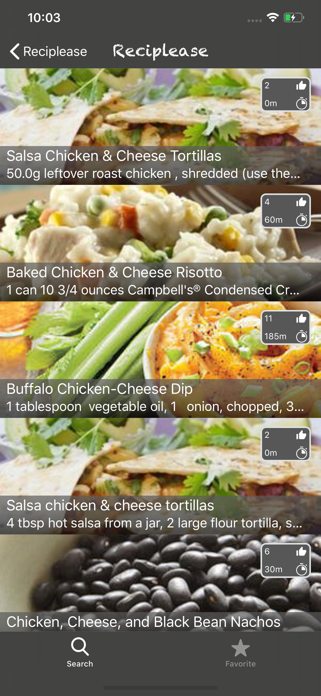
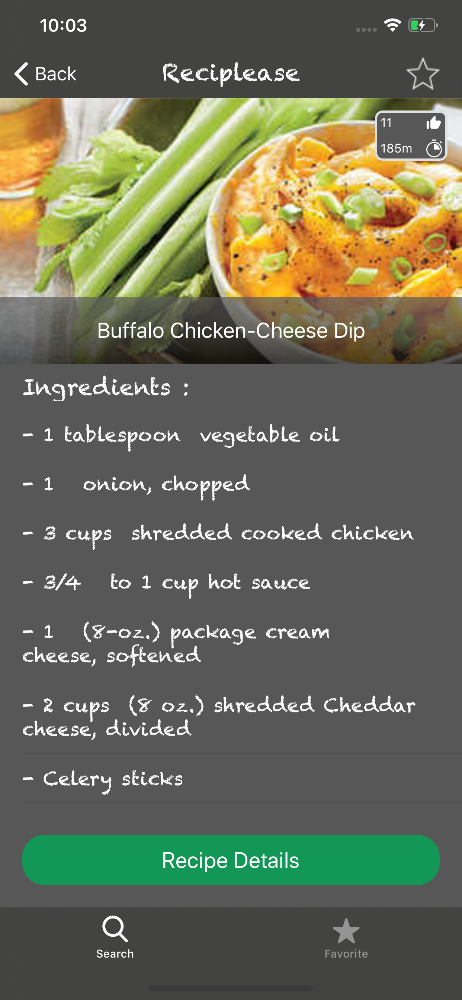
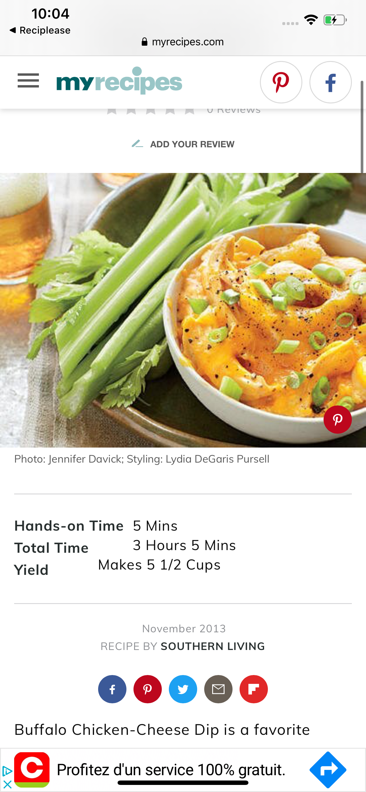
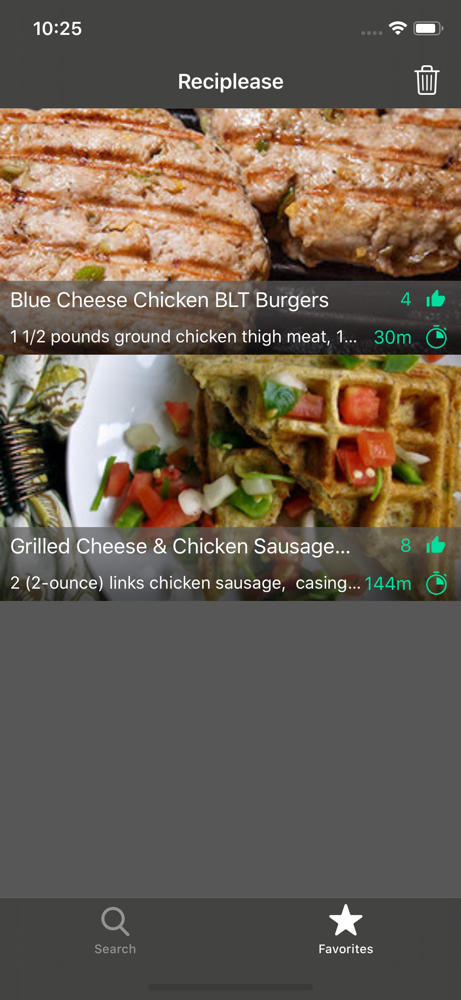

# Reciplease

### Welcome in Reciplease !  
This application allows you to find recipes with the ingredients you have on hand. 

First thing first, enter the ingredients :  
    
 
 
Tap on "Search for recipes" and Reciplease will display a list of recipes :       
 
    
 
Tap on the recipe that interests you and Reciplease will display the ingredients and quantity you'll need :  
 
     

Tap on "Recipe Details" to access the recipe website and recipe details :    
  
     

You'll can also save your favorite recipes in... the "Favorites" section :    

  
  
 ### Enjoy !

  
 
